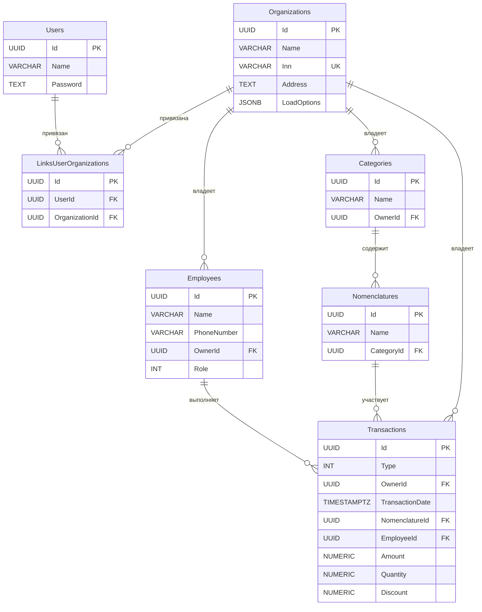

# BusinessTracker — Описание проекта

Персональный кабинет для финансового и логистического мониторинга: учёт продаж, выручки, рабочих смен и расходов на
питание сотрудников.

---

## Архитектура

Проект построен на **Layered Clean Architecture** с чётким разделением ответственностей:

```
BusinessTracker.Domain        ← Доменный слой (бизнес-логика, без зависимостей)
BusinessTracker.Data          ← Слой данных (EF Core, PostgreSQL, репозитории)
BusinessTracker.Api           ← Точка входа API (миграции БД)
BusinessTracker.Console       ← Консольный загрузчик данных из MSSQL
BusinessTracker.Tests         ← Тесты (NUnit 4)
```

### Слой Domain (`BusinessTracker.Domain`)

Не имеет внешних зависимостей. Содержит:

| Папка                | Содержимое                                                                                                                                                              |
|----------------------|-------------------------------------------------------------------------------------------------------------------------------------------------------------------------|
| `Core/Abstractions/` | Интерфейсы (`ILoadingSettingsRepository`, `IRevenueReportRepository`, `ISalesReportRepository`, `IWorkScheduleReportRepository`, `IModel`, `IId`, `IDto`, `IErrorText`) |
| `Core/Enums/`        | `TransactionType`, `EmployeeRole`                                                                                                                                       |
| `Core/Attributes/`   | `TemplateAttribute` (regex-валидация), `ColumnMappingAttribute` (маппинг из ADO.NET)                                                                                    |
| `Models/`            | `DomainModel` (базовый класс с самовалидацией), `Organization`, `Employee`, `Category`, `Nomenclature`, `Transaction`, `LoadingSettings`                                |
| `Models/Dto/`        | `JournalRowDto`, `RevenueReportRowDto`, `SalesReportRowDto`, `WorkScheduleReportRowDto`                                                                                 |
| `Logic/`             | `RevenueReportBuilder`, `SalesReportBuilder`, `WorkScheduleReportBuilder`, `DataMapper`, `ValidationHelper`                                                             |

**Самовалидация** — `DomainModel.Validate()` рекурсивно проверяет:

1. Стандартные атрибуты (`[Required]`, `[Range]`, `[StringLength]`)
2. `[TemplateAttribute]` (регулярные выражения)
3. Вложенные `DomainModel`-объекты

**Построители отчётов** — статические классы. Принимают `IEnumerable<Transaction>` и возвращают Dto:

| Построитель                 | Логика                                                                                                                           |
|-----------------------------|----------------------------------------------------------------------------------------------------------------------------------|
| `RevenueReportBuilder`      | Группировка по дате; вся сумма попадает в `CashAmount` (разбивка по типу оплаты будет реализована после интеграции MSSQL-данных) |
| `SalesReportBuilder`        | Группировка по номенклатуре, суммирование `Quantity`/`Amount`/`Discount`                                                         |
| `WorkScheduleReportBuilder` | Сопоставление `StartShift` и `StopShift` по сотруднику, незакрытая смена — `ShiftEnd = null`                                     |

### Слой Data (`BusinessTracker.Data`)

| Папка         | Содержимое                      |
|---------------|---------------------------------|
| `Models/`     | EF-сущности (зеркало таблиц БД) |
| `Logics/`     | `LoadingSettingsRepository`     |
| `Migrations/` | SQL-скрипты DbUp                |

---

## Схема базы данных



### Перечисления

**`TransactionType`**

| Значение   | Код | Описание        |
|------------|-----|-----------------|
| Sale       | 1   | Продажа         |
| Return     | 2   | Возврат         |
| Change     | 3   | Сдача           |
| StartShift | 4   | Начало смены    |
| StopShift  | 5   | Окончание смены |

**`EmployeeRole`**

| Значение      | Описание                 |
|---------------|--------------------------|
| Manager       | Менеджер (только чтение) |
| Administrator | Полный доступ            |

---

## Миграции базы данных

Используется **DbUp** — миграции применяются при старте `BusinessTracker.Api`.
Скрипты хранятся как Embedded Resources в `BusinessTracker.Data/Migrations/` и выполняются в алфавитном порядке:

| Скрипт          | Описание                                                                   |
|-----------------|----------------------------------------------------------------------------|
| `init.sql`      | Создание всех таблиц и индексов                                            |
| `seed_init.sql` | Начальные данные (2 организации, 1 сотрудник, 1 категория, 1 номенклатура) |

### Шаги для первоначального развёртывания БД

```bash
# 1. Поднять PostgreSQL через Docker
cd _infra && docker-compose up -d

# 2. Запустить API — DbUp применит все миграции автоматически
dotnet run --project BusinessTracker.Api
```

### Добавление новой миграции

1. Создать файл `BusinessTracker.Data/Migrations/<name>.sql`
   Имя должно сортироваться **после** всех существующих скриптов (например, `upgrade_<описание>.sql`).

2. Установить Build Action файла в **Embedded Resource** в `.csproj`:
   ```xml
   <EmbeddedResource Include="Migrations\upgrade_<name>.sql" />
   ```

3. Запустить `dotnet run --project BusinessTracker.Api` — DbUp применит только новые скрипты.

### Сброс и пересоздание схемы

```bash
# Выполнить restore.sql через psql (удаляет и пересоздаёт БД)
psql -h localhost -p 5433 -U admin -d postgres -f _infra/restore.sql

# Затем запустить миграции заново
dotnet run --project BusinessTracker.Api
```

---

## Слой тестов (`BusinessTracker.Tests`)

| Файл                               | Тип            | Описание                                  |
|------------------------------------|----------------|-------------------------------------------|
| `TestApplication.cs`               | Модульный      | Валидация доменных моделей                |
| `TestCurrentApplication.cs`        | Модульный      | Версия приложения                         |
| `TestRevenueReportBuilder.cs`      | Модульный      | Построитель отчёта "Выручка"              |
| `TestSalesReportBuilder.cs`        | Модульный      | Построитель отчёта "Продажи"              |
| `TestWorkScheduleReportBuilder.cs` | Модульный      | Построитель отчёта "График работы"        |
| `TestLoadingSettings.cs`           | Интеграционный | Save/Load для `LoadingSettingsRepository` |
| `TestDbContext.cs`                 | Интеграционный | Базовые запросы к БД                      |

> Интеграционные тесты требуют запущенной PostgreSQL (`docker-compose up`).

---

## Стек технологий

| Компонент              | Технология                    |
|------------------------|-------------------------------|
| Язык                   | C# / .NET 10                  |
| ORM                    | Entity Framework Core 10      |
| База данных (основная) | PostgreSQL 16 (порт 5433)     |
| База данных (источник) | MSSQL (порт 1433, устаревший) |
| Миграции               | DbUp                          |
| Тестирование           | NUnit 4                       |
| Контейнеризация        | Docker / docker-compose       |
