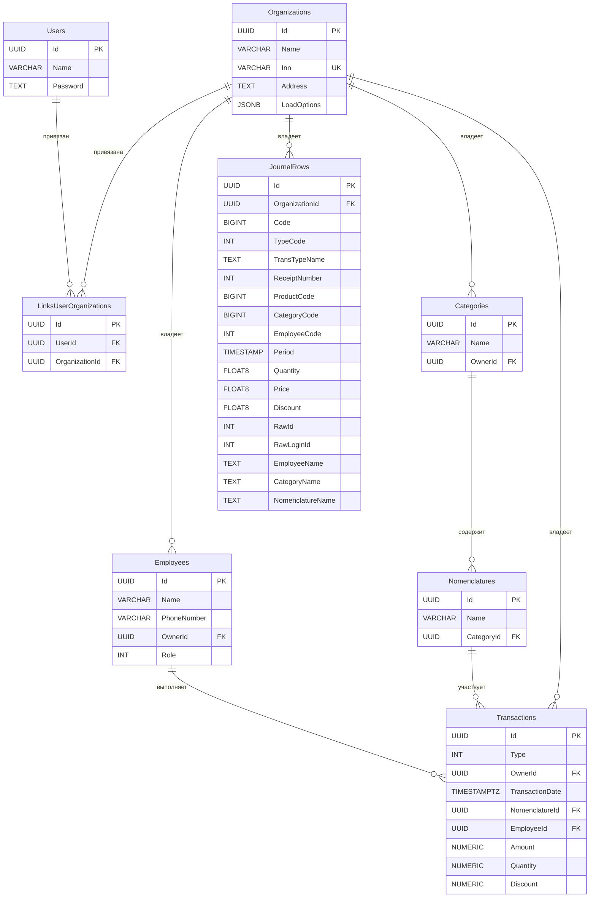

# BusinessTracker — Описание проекта

Персональный кабинет для финансового и логистического мониторинга: учёт продаж, выручки, рабочих смен и расходов на
питание сотрудников.

---

## Архитектура

Проект построен на **Layered Clean Architecture** с чётким разделением ответственностей:

```
BusinessTracker.Domain        ← Доменный слой (бизнес-логика, без зависимостей)
BusinessTracker.Common        ← Общие интерфейсы сервисов и репозиториев
BusinessTracker.Data          ← Слой данных (EF Core, PostgreSQL, репозитории)
BusinessTracker.Api           ← ASP.NET Core API (миграции БД, контроллеры)
BusinessTracker.Console       ← Консольный загрузчик данных из MSSQL
BusinessTracker.Tests         ← Тесты (NUnit 4)
```

### Слой Domain (`BusinessTracker.Domain`)

Не имеет внешних зависимостей. Содержит:

| Папка                | Содержимое                                                                                                                                                                           |
|----------------------|--------------------------------------------------------------------------------------------------------------------------------------------------------------------------------------|
| `Core/Abstractions/` | `ILoadingSettingsRepository`, `IJournalRowsRepository`, `IRevenueReportRepository`, `ISalesReportRepository`, `IWorkScheduleReportRepository`, `IModel`, `IId`, `IDto`, `IErrorText` |
| `Core/Enums/`        | `TransactionType`, `EmployeeRole`                                                                                                                                                    |
| `Core/Attributes/`   | `TemplateAttribute` (regex-валидация), `ColumnMappingAttribute` (маппинг из ADO.NET)                                                                                                 |
| `Models/`            | `DomainModel` (базовый класс с самовалидацией), `Organization`, `Employee`, `Category`, `Nomenclature`, `Transaction`, `LoadingSettings`                                             |
| `Models/Dto/`        | `JournalRowDto`, `RevenueReportRowDto`, `SalesReportRowDto`, `WorkScheduleReportRowDto`                                                                                              |
| `Logic/`             | `RevenueReportBuilder`, `SalesReportBuilder`, `WorkScheduleReportBuilder`, `DataMapper`, `ValidationHelper`                                                                          |

**Самовалидация** — `DomainModel.Validate()` рекурсивно проверяет:

1. Стандартные атрибуты (`[Required]`, `[Range]`, `[StringLength]`)
2. `[TemplateAttribute]` (регулярные выражения)
3. Вложенные `DomainModel`-объекты

**`JournalRowDto`** — плоская запись из журнала клиентской программы (legacy MSSQL). Поля:

| Поле               | Источник        | Описание                                     |
|--------------------|-----------------|----------------------------------------------|
| `Code`             | `journalid`     | Уникальный код транзакции                    |
| `TypeCode`         | `transtype`     | Код типа транзакции                          |
| `TransTypeName`    | `TransTypeName` | Наименование типа                            |
| `ReceiptNumber`    | `checknum`      | Номер чека                                   |
| `ProductCode`      | вычисляется     | Код продукта                                 |
| `CategoryCode`     | вычисляется     | Код категории                                |
| `EmployeeCode`     | вычисляется     | Код сотрудника                               |
| `Period`           | `dater`         | Дата и время транзакции                      |
| `Quantity`         | `quantity`      | Количество                                   |
| `Price`            | `price`         | Цена                                         |
| `Discount`         | `sumdiscount`   | Скидка                                       |
| `EmployeeName`     | —               | Имя сотрудника (расширенное поле)            |
| `CategoryName`     | —               | Наименование категории (расширенное поле)    |
| `NomenclatureName` | —               | Наименование номенклатуры (расширенное поле) |

**Построители отчётов** — статические классы. Принимают `IEnumerable<Transaction>` и возвращают Dto:

| Построитель                 | Логика                                                                                                                           |
|-----------------------------|----------------------------------------------------------------------------------------------------------------------------------|
| `RevenueReportBuilder`      | Группировка по дате; вся сумма попадает в `CashAmount` (разбивка по типу оплаты будет реализована после интеграции MSSQL-данных) |
| `SalesReportBuilder`        | Группировка по номенклатуре, суммирование `Quantity`/`Amount`/`Discount`                                                         |
| `WorkScheduleReportBuilder` | Сопоставление `StartShift` и `StopShift` по сотруднику, незакрытая смена — `ShiftEnd = null`                                     |

---

### Слой Common (`BusinessTracker.Common`)

Общие интерфейсы, разделяемые между Api и Console:

| Интерфейс              | Описание                                          |
|------------------------|---------------------------------------------------|
| `ILoadingService`      | Push/PushAsync — приём и обработка транзакций     |
| `ISavingService`       | Save/SaveAsync — сохранение транзакций            |
| `IClientRepository<T>` | GetRows — чтение записей из клиентской БД (MSSQL) |
| `IHandler<T>`          | Маркерный интерфейс репозиториев                  |

---

### Слой Data (`BusinessTracker.Data`)

| Папка         | Содержимое                                            |
|---------------|-------------------------------------------------------|
| `Models/`     | EF-сущности (зеркало таблиц БД), включая `JournalRow` |
| `Logics/`     | `LoadingSettingsRepository`, `JournalRowsRepository`  |
| `Extensions/` | `RegistryExtension` — DI-регистрация зависимостей     |
| `Migrations/` | SQL-скрипты DbUp                                      |

**DI-регистрация** (`RegistryExtension`) поддерживает два варианта вызова:

```csharp
// С IConfiguration — строка подключения из ConnectionStrings:DefaultConnection
services.RegisterBusinessTrackerData(configuration);

// С явной строкой подключения (проброс из модели настроек)
services.RegisterBusinessTrackerData(connectionString);
```

Регистрируются как `Scoped`:

- `BusinessTrackerContext`
- `ILoadingSettingsRepository` → `LoadingSettingsRepository`
- `IJournalRowsRepository` → `JournalRowsRepository`

---

### Слой API (`BusinessTracker.Api`)

Точка входа: `Program.cs`

- Читает настройки из `ApiOptions` (через `IOptions<ApiOptions>`)
- Применяет DbUp-миграции при старте
- Регистрирует зависимости через `RegisterBusinessTrackerData`
- Слушает на `http://0.0.0.0:8000`

**Модель настроек** (`ApiOptions`):

```json
{
  "ApiOptions": {
    "PostgreConnectionString": "Host=localhost;Port=5433;...",
    "MsSqlConnectionString": ""
  }
}
```

**Контроллеры:**

| Контроллер          | Метод | Маршрут             | Описание                                          |
|---------------------|-------|---------------------|---------------------------------------------------|
| `JournalController` | POST  | `/api/journal/push` | Приём списка транзакций от клиентского приложения |

Тело запроса (`PushTransactionsRequest`):

```json
{
  "organizationId": "<uuid>",
  "transactions": [ { ... } ]
}
```

Контроллер резолвит организацию из БД по `organizationId` и вызывает `ILoadingService.PushAsync`.

**Сервис `LoadingService`:**

1. Загружает `LoadingSettings` из репозитория (фильтр по `StartPosition`)
2. Отсекает уже обработанные транзакции (`Code < StartPosition`)
3. Сохраняет новые строки в `JournalRows` через `IJournalRowsRepository`
4. Обновляет `StartPosition` = max Code батча

---

### Слой Console (`BusinessTracker.Console`)

Консольное приложение с полноценным DI-контейнером.

**Модель настроек** (`ConsoleOptions`):

```json
{
  "ConsoleOptions": {
    "MsSqlConnectionString": "Server=...;Database=PersonalAccount;...",
    "PostgreConnectionString": "Host=localhost;Port=5433;...",
    "ApiBaseUrl": "http://localhost:8000"
  }
}
```

**DI-регистрация** (`Console/Extensions/RegistryExtension`):

- `ConsoleOptions` через `IOptions<ConsoleOptions>`
- `IClientRepository<JournalRowDto>` → `JournalRepository`
- `HttpClient` с именем `"api"`, BaseAddress = `ApiBaseUrl`

**Цикл работы** (`Program.cs`):

1. Открывает соединение с MSSQL через `ConsoleOptions.MsSqlConnectionString`
2. Загружает записи журнала через `IClientRepository<JournalRowDto>.GetRows()`
3. Отправляет POST `/api/journal/push` через `HttpClient`
4. Смещает `StartPosition` для следующего батча
5. Ожидает 1 час и повторяет

---

## Схема базы данных



### Перечисления

**`TransactionType`**

| Значение   | Код | Описание        |
|------------|-----|-----------------|
| Sale       | 1   | Продажа         |
| Return     | 2   | Возврат         |
| Change     | 3   | Сдача           |
| StartShift | 4   | Начало смены    |
| StopShift  | 5   | Окончание смены |

**`EmployeeRole`**

| Значение      | Описание                 |
|---------------|--------------------------|
| Manager       | Менеджер (только чтение) |
| Administrator | Полный доступ            |

---

## Миграции базы данных

Используется **DbUp** — миграции применяются при старте `BusinessTracker.Api`.
Скрипты хранятся как Embedded Resources в `BusinessTracker.Data/Migrations/` и выполняются в алфавитном порядке:

| Скрипт                         | Описание                                                                   |
|--------------------------------|----------------------------------------------------------------------------|
| `init.sql`                     | Создание всех таблиц и индексов                                            |
| `seed_init.sql`                | Начальные данные (2 организации, 1 сотрудник, 1 категория, 1 номенклатура) |
| `upgrade_001_journal_rows.sql` | Таблица `JournalRows` для хранения плоских записей из MSSQL-журнала        |

### Шаги для первоначального развёртывания БД

```bash
# 1. Поднять PostgreSQL через Docker
cd _infra && docker-compose up -d

# 2. Запустить API — DbUp применит все миграции автоматически
dotnet run --project BusinessTracker.Api
```

### Добавление новой миграции

1. Создать файл `BusinessTracker.Data/Migrations/<name>.sql`
   Имя должно сортироваться **после** всех существующих скриптов (например, `upgrade_<описание>.sql`).

2. Убедиться, что файл попадает под `<EmbeddedResource Include="Migrations\*.*">` в `.csproj` (настроено глобально).

3. Запустить `dotnet run --project BusinessTracker.Api` — DbUp применит только новые скрипты.

### Сброс и пересоздание схемы

```bash
# Выполнить restore.sql через psql (удаляет и пересоздаёт БД)
psql -h localhost -p 5433 -U admin -d postgres -f _infra/restore.sql

# Затем запустить миграции заново
dotnet run --project BusinessTracker.Api
```

---

## Слой тестов (`BusinessTracker.Tests`)

| Файл                               | Тип            | Описание                                        |
|------------------------------------|----------------|-------------------------------------------------|
| `TestApplication.cs`               | Модульный      | Валидация доменных моделей                      |
| `TestCurrentApplication.cs`        | Модульный      | Версия приложения                               |
| `TestRevenueReportBuilder.cs`      | Модульный      | Построитель отчёта «Выручка»                    |
| `TestSalesReportBuilder.cs`        | Модульный      | Построитель отчёта «Продажи»                    |
| `TestWorkScheduleReportBuilder.cs` | Модульный      | Построитель отчёта «График работы»              |
| `TestLoadingSettings.cs`           | Интеграционный | Save/Load для `ILoadingSettingsRepository` (DI) |
| `TestLoadingService.cs`            | Интеграционный | Push через `IJournalRowsRepository` (DI)        |
| `TestDbContext.cs`                 | Интеграционный | Базовые запросы к БД                            |

> Интеграционные тесты требуют запущенной PostgreSQL (`docker-compose up`).

Все интеграционные тесты используют DI-контейнер (`ServiceProvider`) через `RegisterBusinessTrackerData(configuration)`.
`TestLoadingService` дополнительно гарантирует наличие таблицы `JournalRows` и сбрасывает `LoadOptions` организации
перед каждым тестом.

---

## Стек технологий

| Компонент              | Технология                    |
|------------------------|-------------------------------|
| Язык                   | C# / .NET 10                  |
| ORM                    | Entity Framework Core 10      |
| База данных (основная) | PostgreSQL 16 (порт 5433)     |
| База данных (источник) | MSSQL (порт 1433, устаревший) |
| Миграции               | DbUp                          |
| Тестирование           | NUnit 4                       |
| HTTP-клиент            | System.Net.Http.HttpClient    |
| Контейнеризация        | Docker / docker-compose       |
