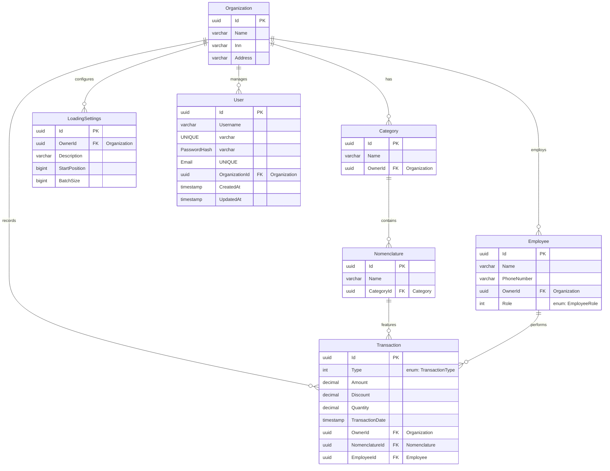

```mermaid
erDiagram
    Organization ||--o{ Category: "has"
    Organization ||--o{ Employee: "employs"
    Organization ||--o{ LoadingSettings: "configures"
    Organization ||--o{ Transaction: "records"
    Organization ||--o{ User: "manages"
    Category ||--o{ Nomenclature: "contains"
    Nomenclature ||--o{ Transaction: "features"
    Employee ||--o{ Transaction: "performs"

    Organization {
        uuid Id PK
        varchar Name
        varchar Inn
        varchar Address
    }

    Category {
        uuid Id PK
        varchar Name
        uuid OwnerId FK "Organization"
    }

    Employee {
        uuid Id PK
        varchar Name
        varchar PhoneNumber
        uuid OwnerId FK "Organization"
        int Role "enum: EmployeeRole"
    }

    LoadingSettings {
        uuid Id PK
        uuid OwnerId FK "Organization"
        varchar Description
        bigint StartPosition
        bigint BatchSize
    }

    Nomenclature {
        uuid Id PK
        varchar Name
        uuid CategoryId FK "Category"
    }

    Transaction {
        uuid Id PK
        int Type "enum: TransactionType"
        decimal Amount
        decimal Discount
        decimal Quantity
        timestamp TransactionDate
        uuid OwnerId FK "Organization"
        uuid NomenclatureId FK "Nomenclature"
        uuid EmployeeId FK "Employee"
    }

    User {
uuid Id PK
varchar Username UNIQUE
        varchar PasswordHash
varchar Email UNIQUE
uuid OrganizationId FK "Organization"
timestamp CreatedAt
timestamp UpdatedAt
}
```